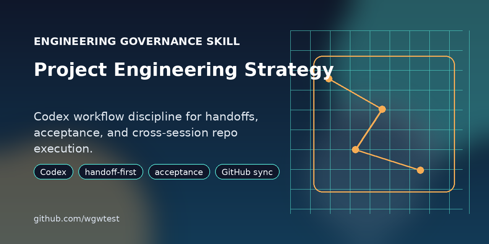

# Project Engineering Strategy

[](https://github.com/wgwtest/project-engineering-strategy)

[](https://github.com/wgwtest/project-engineering-strategy/stargazers)
[](https://github.com/wgwtest/project-engineering-strategy/releases)
[](./LICENSE)

A Codex skill for teams or solo developers who want engineering work to stay stable across sessions, branches, issues, and handoffs instead of drifting into chat-only execution.

## Why Use It

This skill is for repositories where "just continue from the last chat" is not reliable enough.

It pushes Codex toward a more disciplined workflow:

- read the current handoff, checklist, and recent test evidence before editing
- fix models, contracts, runtime behavior, and event chains before polishing UI
- keep GitHub tracker state, execution contracts, and local docs synchronized
- separate self-test evidence from human acceptance
- avoid treating worktrees or temporary paths as official delivery paths

## Before vs After

A fresh Codex session on a real repository tends to fail in predictable ways.

### Without This Skill

- Codex starts editing from recent chat memory instead of checking the actual handoff
- UI polish starts before models, contracts, or runtime behavior are verified
- self-test results and human acceptance get blended together
- implementation moves ahead while issue, project, or doc state drifts

### With This Skill

- Codex identifies the current handoff, acceptance state, and recent test evidence before editing
- execution starts from models, contracts, runtime behavior, and event chains before UI cleanup
- self-test evidence is reported separately from human acceptance
- repo docs, tracker state, and execution context stay aligned in the same round

That is the core shift: less chat-only continuity, more project-level continuity.

## Good Fit

Use this repo if you want Codex to act more like a project engineer and less like a stateless patch generator.

It is especially useful when your project has:

- multiple sessions over days or weeks
- handoff docs or acceptance checklists
- GitHub Issues or Projects as execution surfaces
- branch or worktree-based isolation
- explicit self-test and human acceptance stages

## Example Prompts

- `Use project-engineering-strategy. This repo needs a stable Codex workflow across sessions.`
- `Before editing anything, tell me which handoff, acceptance, and self-test artifacts you expect in this project.`
- `Keep GitHub Project status, the execution issue, and local docs in sync while implementing this task.`

## Install

Manual install:

```bash
git clone https://github.com/wgwtest/project-engineering-strategy.git
mkdir -p ~/.codex/skills
cp -R project-engineering-strategy/project-engineering-strategy ~/.codex/skills/project-engineering-strategy
```

For local development with easy upgrades:

```bash
git clone https://github.com/wgwtest/project-engineering-strategy.git
mkdir -p ~/.codex/skills
ln -s "$(pwd)/project-engineering-strategy/project-engineering-strategy" ~/.codex/skills/project-engineering-strategy
```

Restart Codex after installing or updating the skill.

Installer-style inputs:

- repo: `wgwtest/project-engineering-strategy`
- path: `project-engineering-strategy`

## Repository Layout

- `project-engineering-strategy/`: installable skill package
- `README.md`: landing page for humans
- `.github/`: templates for issues and pull requests

The installable skill lives in a subdirectory so the repository root can hold public-facing files without polluting the package itself.

## Related Repos

- [novel-writing](https://github.com/wgwtest/novel-writing): fiction planning, drafting, and revision
- [novel-project-strategy](https://github.com/wgwtest/novel-project-strategy): longform fiction workflow and recovery

## Contributing

If you want to improve the skill, start with [CONTRIBUTING.md](./CONTRIBUTING.md). Precise examples, better trigger wording, and clearer real-world usage prompts are more valuable than generic advice.

## License

MIT. See [LICENSE](./LICENSE).

## Maintainer Note

This public repository is synced from a separate source-of-truth workspace. Keep the root landing files and the installable package aligned in the same release.
